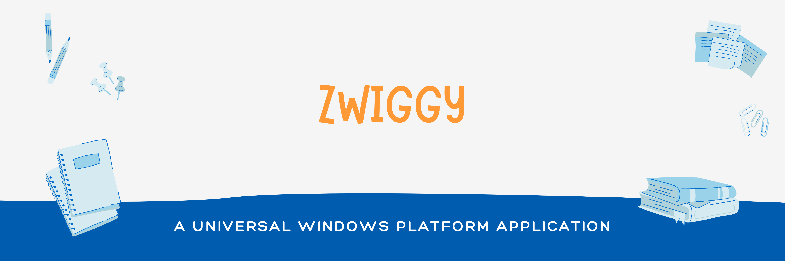

<h2> 🚚 ZWIGGY </h2>
Zwiggy Application was whipped up based on the thought that "What if food delivery application is available as a Native Application?". Zwiggy is a Windows Native Application, It was built using Universal Windows Platform API's which helps us to publish our application across various devices. A Quick Walkthrough of the application will be embedded below,
 
 

https://github.com/Ajaiqmar/ZWIGGY/assets/54910043/b50816ae-8e15-4405-8b36-6a59a5416fe6

 
<h2> 🏭 Architecture </h2>
Clean Architecture was used 

 

